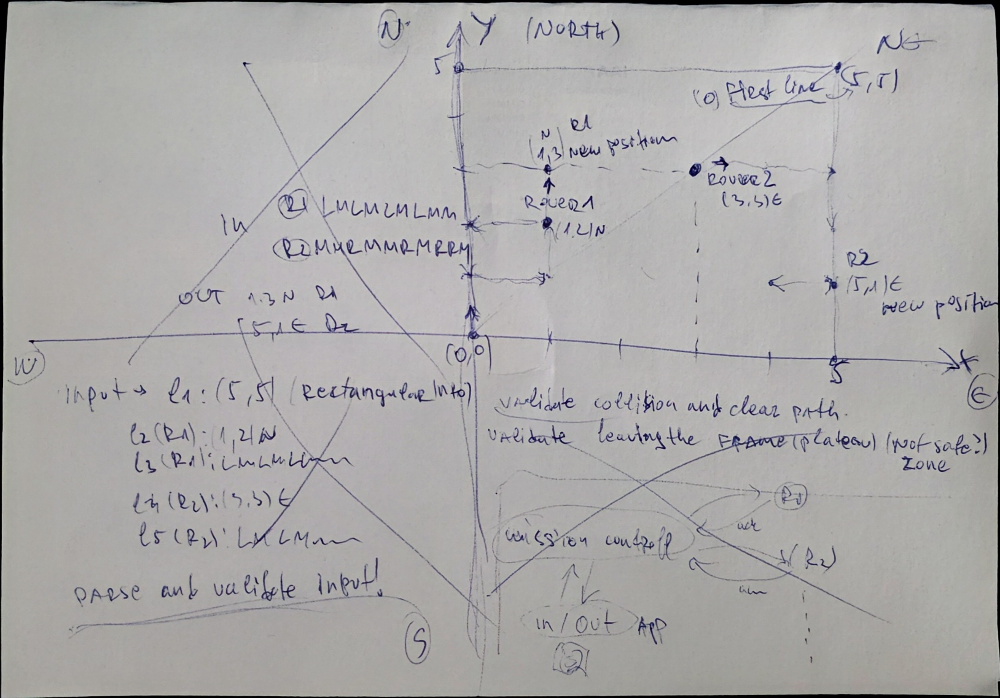

# MissionToMars

This repository contains my implementation of the given Mars Rover interview assignment.

I approached the task as more than a simple command-line parser that moves rovers around a grid. The basic requirement is to calculate the final rover positions from a rectangular plateau, starting positions, and movement instructions. My solution keeps that required behavior, but structures it as a small mission-control system with validation, planning, execution orchestration, mocked delivery, acknowledgements, and unit tests.

The intention behind this design is to show how I would think about the problem if rover movement commands were not just local calculations, but mission instructions that should be validated before execution and confirmed before continuing to the next rover.

## My Approach

The solution is split into two main phases:

1. Mission planning
2. Mission execution

Planning answers:

> Is the mission valid, and what should happen?

Execution answers:

> Did the rover report that the expected movement actually happened?

This separation is intentional as it keeps validation and expected-state calculation separate from command dispatching and acknowledgement handling.

## Planning Notes

Before implementation, I sketched the main flow and validation rules to clarify how rovers should be processed sequentially and how final positions should be reserved.



The sketch helped define the main decisions used in the implementation:

* The plateau is treated as a bounded safe area.
* Rovers are processed sequentially.
* Each rover is planned before the mission is accepted.
* Once a rover has a calculated final position, that position is reserved for the following rovers.
* If any rover would leave the plateau or collide with a previously planned final rover position, the whole mission is rejected.
* Mission execution should only continue to the next rover after the previous rover has been acknowledged and verified.

## Validation-First Design

The mission is not executed immediately after parsing.

First, the full input is parsed into a mission plan. Then the mission planner validates the rovers one by one in the same order they appear in the input.

For example:

1. Rover 1 is simulated from its starting position.
2. If Rover 1 is valid, its calculated final position is reserved.
3. Rover 2 is then simulated while taking Rover 1's reserved final position into account.
4. If Rover 2 is valid, its calculated final position is also reserved.
5. The same process continues for any remaining rovers.

If any validation rule fails, the full mission is rejected and a clear error message is returned.

I chose this behavior because partial execution would be unsafe and unclear. If one rover plan is invalid, the system should not continue producing partial mission results as if the mission succeeded.

## Validation Rules

The implementation validates the following cases:

* Plateau input must be valid.
* Rover starting positions must be inside the plateau.
* Rover directions must be valid.
* Instructions must only contain `L`, `R`, and `M`.
* A rover must not move outside the plateau.
* A rover must not start on a final position already reserved by a previously planned rover.
* A rover must not move into a final position already reserved by a previously planned rover.
* If validation fails at any point, the whole mission is rejected.

The collision rule is intentionally based on previously calculated final rover positions, not the full historical path of each rover.

That means if Rover 1 passes through a position but finishes somewhere else, that passed-through position is not blocked for Rover 2. Only Rover 1's final calculated position is reserved.

## Execution Flow

After a mission plan is validated successfully, the solution simulates a mission-control execution flow.

Each planned rover step is dispatched one at a time.

The execution flow is:

1. Store the rover command in an in-memory outbox.
2. Dispatch the command through an abstraction.
3. Receive a mocked rover acknowledgement.
4. Verify the acknowledged final state against the expected planned final state.
5. Continue to the next rover only if verification succeeds.

If the acknowledgement does not match the expected final state, the mission execution fails and no further rover commands are dispatched.

This is intentionally designed around abstractions so that mocked components can later be replaced by real infrastructure without changing the mission planning or orchestration logic.

## Project Structure

```text
MissionToMars/
  MissionToMars.sln
  README.md
  docs/
    NET Backend Lead Engineer - Tech Challenge.pdf
    planning-doodle.jpg 
  MissionToMars.Domain/
  MissionToMars.MissionControl/
  MissionToMars.Infrastructure/
  MissionToMars/
  MissionToMars.Tests/
```

## Projects

### MissionToMars.Domain

Contains the core domain models and rules.

This project contains simple domain objects such as:

* `Plateau`
* `Position`
* `RoverState`
* `RoverMissionInput`
* `MissionPlan`
* `PlannedMission`
* `PlannedRoverStep`

The domain project does not depend on infrastructure or console-specific code.

### MissionToMars.MissionControl

Contains the main use cases and orchestration logic.

This project includes:

* Mission input parsing
* Mission planning
* Mission execution orchestration
* Mission runner
* Application-level abstractions

The important services in this layer are:

* `IMissionInputParser`
* `IMissionPlanner`
* `IMissionRunner`
* `IMissionExecutionOrchestrator`
* `ICommandOutbox`
* `IRoverCommandDispatcher`
* `IRoverAcknowledgementReceiver`
* `IRoverStateStore`

This layer depends on the domain project, but not on concrete infrastructure implementations.

### MissionToMars.Infrastructure

Contains in-memory and mocked implementations of the mission-control abstractions.

This project includes:

- In-memory command outbox
- Mock rover command dispatcher
- Mock rover acknowledgement receiver
- In-memory rover state store

These implementations are intentionally replaceable. For this assignment they are kept in-memory and mocked so the solution stays simple, fast to run, and easy to test.

In a real system, these infrastructure components could be replaced with production services. For example, the in-memory outbox could become a database-backed outbox using SQL Server or PostgreSQL. 
Command dispatching could be handled through a message broker such as Azure Service Bus, RabbitMQ, Kafka, or AWS SQS. 
Rover acknowledgements could be received through an event-driven consumer, webhook endpoint, HTTP/gRPC API, or telemetry ingestion service. 
Rover state could be stored in a relational database, document database, or time-series/telemetry store depending on how much historical mission data needs to be retained.

The important point is that these replacements would not require changes in the mission planning logic. 
The `MissionToMars.MissionControl` layer depends only on abstractions, while `MissionToMars.Infrastructure` owns the concrete delivery, storage, and communication details.

### MissionToMars.Console

Contains the console entry point.

The console application is intentionally simple. It stays open, accepts mission input, runs the mission, prints the result, and then waits for another attempt.

The console project acts as the composition root. It wires together the MissionControl and Infrastructure services through dependency injection.

### MissionToMars.Tests

Contains unit tests for the main behavior.

The tests cover successful and failing scenarios around:

* Parsing
* Mission planning
* Boundary validation
* Collision validation
* Mission execution
* Acknowledgement verification
* Dependency injection composition

## Dependency Injection

The solution uses dependency injection to keep the mission-control layer independent from concrete infrastructure.

The console app registers services through layer-specific service registration methods.

Mission-control services are registered separately from infrastructure services.

This keeps the dependency direction clean:

```text
MissionToMars.Console
  -> MissionToMars.MissionControl
  -> MissionToMars.Domain

MissionToMars.Console
  -> MissionToMars.Infrastructure
  -> MissionToMars.MissionControl
```

The important rule is that `MissionToMars.MissionControl` does not depend on `MissionToMars.Infrastructure`.

Infrastructure depends on MissionControl because it implements the interfaces defined there.

## SOLID Considerations

The solution is structured to respect SOLID principles without adding unnecessary complexity.

### Single Responsibility

Each major class has a focused responsibility:

* `MissionInputParser` parses input.
* `MissionPlanner` validates and calculates expected final states.
* `MissionExecutionOrchestrator` coordinates command dispatch and acknowledgement verification.
* `MissionRunner` connects parsing, planning, and execution.
* Infrastructure classes handle mocked delivery, acknowledgements, outbox state, and rover state.

### Open/Closed

The core logic is open for extension through abstractions.

For example, these components can be replaced without changing the mission planner or orchestrator:

* command outbox
* rover command dispatcher
* acknowledgement receiver
* rover state store

### Liskov Substitution

The solution uses Liskov Substitution mainly through the infrastructure abstractions.

`MissionExecutionOrchestrator` depends on interfaces such as `ICommandOutbox`, `IRoverCommandDispatcher`, `IRoverAcknowledgementReceiver`, and `IRoverStateStore`, not on concrete classes. 
This means the current in-memory and mock implementations can be replaced by real implementations without changing the orchestration logic.

For example, `MockRoverCommandDispatcher` could later be replaced by an HTTP, Azure Service Bus, RabbitMQ, Kafka, or AWS SQS based dispatcher, as long as the replacement respects the same contract.

The important part is that every implementation must behave consistently from the caller's point of view: 
successful dispatch should be reported as success, failed dispatch should be reported as failure, acknowledgements should contain the expected command and rover state information, 
and state stores should persist and return rover state according to the interface contract.

This keeps the mission-control layer stable while allowing infrastructure implementations to change.

### Interface Segregation

The interfaces are intentionally small and focused instead of using one large mission service interface.

### Dependency Inversion

Mission-control logic depends on interfaces, not concrete infrastructure.

The concrete implementations are registered from the console composition root.

## Running the Console App

From the solution root:

```bash
dotnet run --project src/MissionToMars.Console
```

The console will wait for mission input.

Paste input in this format:

```text
5 5
1 2 N
LMLMLMLMM
3 3 E
MMRMMRMRRM
```

Then press Enter on an empty line to run the mission.

Expected output:

```text
1 3 N
5 1 E
```

The application will remain open and wait for another attempt.

Type:

```text
exit
```

to close the console app.

## Running Tests

From the solution root:

```bash
dotnet test
```
 
## Example Valid Input

```text
5 5
1 2 N
LMLMLMLMM
3 3 E
MMRMMRMRRM
```

Expected result:

```text
1 3 N
5 1 E
```

## Example Invalid Mission

```text
5 5
5 5 N
M
```

This mission is invalid because the rover would move outside the plateau.

The mission is rejected instead of partially executed.

## Design Decision: Reject Full Mission on Invalid Input

I intentionally chose to reject the whole mission if any rover plan is invalid.

The alternative would be to skip invalid moves or return partial output, but that would make the behavior less clear. 
In a real mission-control scenario, commands should be validated before execution, and a failure in the plan should prevent the mission from being accepted.

This also keeps the behavior deterministic and easier to test.

## Design Decision: Mocked Reliable Delivery

The assignment itself only requires calculating final rover positions. I added a mocked execution layer to show how I would separate planning from delivery and confirmation.

The execution layer includes:

* command storage through an outbox abstraction;
* dispatch through a rover command dispatcher abstraction;
* acknowledgement through a receiver abstraction;
* final state verification before continuing.

This does not introduce real networking, queues, databases, or background workers. It only models the boundaries so that the system remains testable and replaceable.

## Technology

* .NET 10
* C#
* xUnit

## Summary

This solution solves the required rover movement assignment while also showing how I would structure the problem with validation, orchestration, dependency inversion, mocked infrastructure, and unit testing.

The added structure demonstrates how the same problem can be approached as a safer mission-planning and execution workflow, and not just simple calculations for final rover positions.
